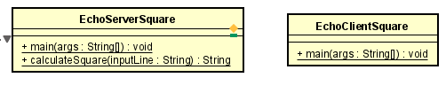
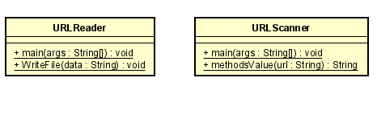
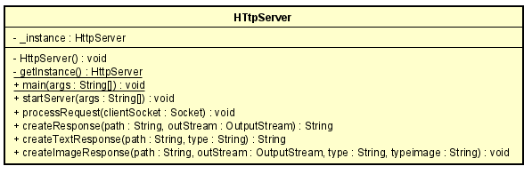

# Clientes y servicios
### Daniel Santiago Ducuara Ardila
### 07/09/2021

## EJERCICIO 1
Escriba un programa en el cual usted cree un objeto URL e imprima en pantalla cada uno de los componentes de una URL. 
Es decir , debe usar los siguientes métodos: getProtocol, getAuthority, getHost, getPort, getPath, getQuery, getFile, getRef. 
Asegúrese que ninguno imprima una cadena vacía, esto implica que la URL que use para su objeto debe contener datos suficientes.

## EJERCICIO 2
Escriba una aplicación browser que dada una URL lea datos de esa dirección y que los almacene en un archivo con el nombre resultado.html. 
Intente ver este archivo en el navegador. Su implementación debe ser un programa que reciba el parámetro de URL por medio de la línea de comandos.

## EJERCICIO 3
Usando sockets escriba un servidor que reciba un número y responda el cuadrado de este número. Escriba un cliente para probarlo y envíele 
una secuencia de 20 números.

RETO 1
Escriba un servidor web que soporte múlltiples solicitudes seguidas (no concurrentes). El servidor debe retornar todos los archivos 
solicitados, incluyendo páginas html e imágenes. Construya un sitio web con javascript para probar su servidor. Despliegue su solución 
en Heroku. NO use frameworks web como Spark o Spring use solo Java y las librerías para manejo de la red.

## Diagrama de clases

### Paquete Square
 
En el paquete Square se divide en dos clases, el cliente y el servidor, en el método main de ambas clases se inicia el proceso
de conexión entre ambos, en el servidor el método calculateSquare recibe como entrada el número que vaya ingresando la clase cliente 
y el método le retorna el número que recibió al cuadrado. Para cerrar la conexión es necesario escribir "Bye.".
Para la ejecución es necesario iniciar primero el servidor y luego el cliente. la clase cliente empieza a enviar números y el servidor
irá respondiendo.
### Paquete URL
 
El URLReader en el método main recibe una url, el método guarda la información html de la página y envía esta información al método writeFile,
esté método se encarga de crear un archivo llamado resultado.html con la información guardada, este archivo se creará en la raiz de la carpeta.

El URLScanner recibe una url en el método main y la envía al método methodsValue que retorna la información de los 8 métodos que retornan lainformación del
objeto URL.
### Paquete HttpServer
 
El paquete HttpServer se encarga de crear un servidor que soporte múltiples solicitudes, la clase cuenta con métodos como startServer en el cual se inicia la conexión 
al servidor, en el método processRequest se crea la solicitud del servidor y en el método createTextResponse retorna la información del archivo html.
Para la ejecución es necesario iniciar el servidor y en el navegador colocar 127.0.0.1:35000/archivo, para la parte del archivo se encuentran 3 archivos en la 
carpeta TestHttpServer para probar con dichos archivos.

## Reporte de pruebas
 
Se realiza el reporte de pruebas con todas las pruebas satisfactorias.
Para las pruebas de HttpServer se encuentra la carpeta TestHttpServer con 3 archivos html y 3 imágenes en formato png,jpg y jfif.
Al ejecutar las pruebas se crea un archivo resultado.html en la raiz de la carpeta, si este archivo se crea quiere decir que la prueba de 
URLReader es satisfactoria. 
